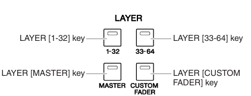

When doing anything that requires the belt pack mics, the board should be in "show" mode. Riordan and other admin often put it in "speech" mode, which while while you could use for a show, it's not ideal given that it scrambles the mic on the board. This way the channels on the board line up with the numbers on the pack itself. 

The first layer is where you're mics and sound cues will be. 1 and 2 are handheld mics while 3 - 14 are belt pack mics. If these do not line up with the channel numbers on the first layer, something has gone wrong check what mode the board is in.