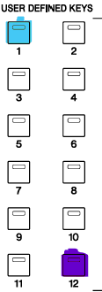
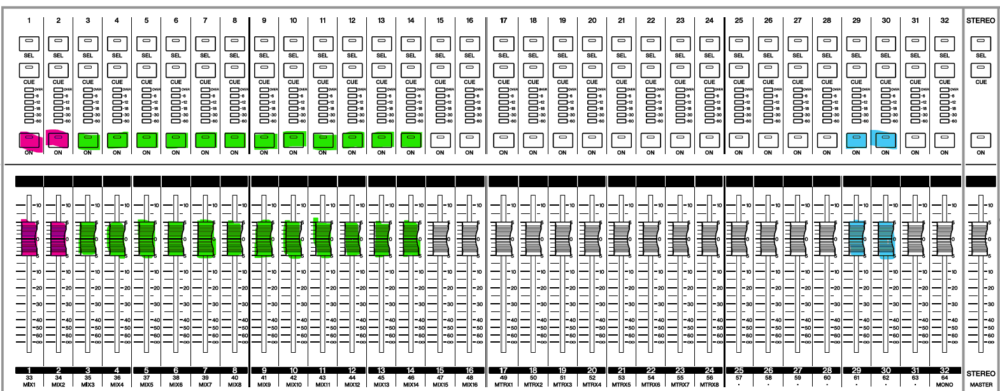

[Setting Up](tags/Setting%20Up.md)
When doing anything that requires the belt pack mics, the board should be in "show" mode. Riordan and other admin often put it in "speech" mode, which while while you could use for a show, it's not ideal given that it scrambles the mic on the board. This way the channels on the board line up with the numbers on the pack itself. 

(Blue is Speech, Purple is show)

The first layer is where you're mics and sound cues will be. 1 and 2 are handheld mics while 3 - 14 are belt pack mics. If these do not line up with the channel numbers on the first layer, something has gone wrong check what mode the board is in. For the sound cues are on channel 29/30==. You can check if the computer is properly working if 29/30 are tied together while moving==, if you move one the other should move with it. This is because the computer outputs in stereo so these channels represent the left and right side.

(It is also quite common for a very staticky if the channel is open even if nothing is being played from the computer, this is normal cause the cable is lowkey crap) - though if Fergie's reading this and wants to get a new XLR to 3.5mm cable this part of the section might not be needed, wink wink nudge nudge.

If you want to try to reduce the static, it typically resolves itself but resetting the computer and reseating the cable can reduce it.

(Pink is handheld, Green is belt pack, blue is computer output)